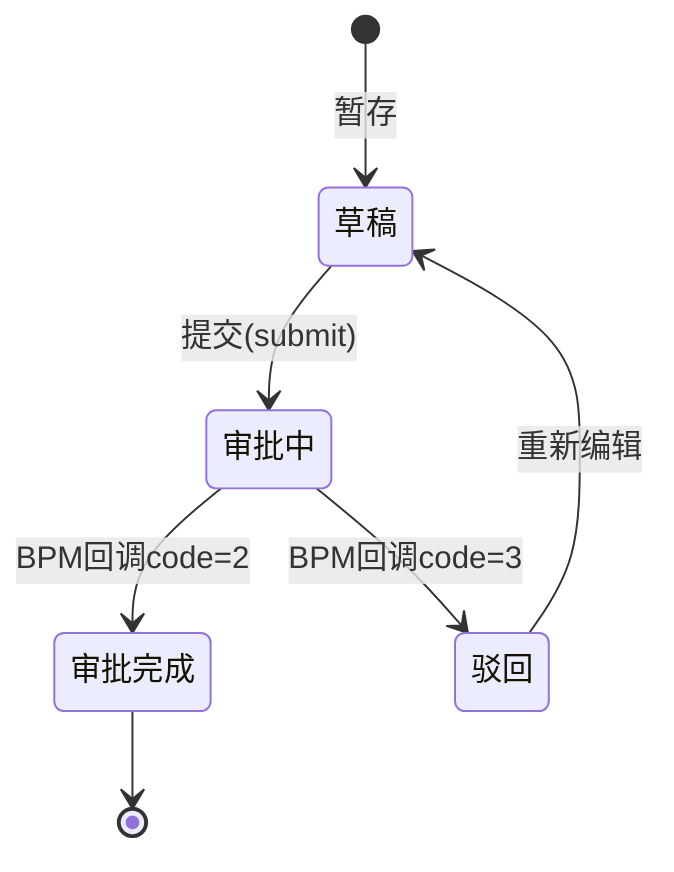

# PM3 Step 2: 领域建模器

## 职责边界

**只做这些**:
- 将 PRD 字段映射为 Java 实体字段（类型推断）
- 设计主表结构（是否需要 Main 表等附属表）
- 绘制实体关系图
- 推导状态机（state → transitions）
- 生成 DDL 建表语句草稿

**不做这些**（留给后续 skill）:
- 不设计 API 路径
- 不生成权限标识
- 不设计工作流变量

---

## 执行步骤

### Step 1: 读取解析报告

读取 `prd-parse-report.md`，重点关注：
- 字段清单（第2节）
- 状态清单（第4节）
- 业务规则（第5节，判断是否需要附属表）

**如果 prd-parse-report.md 不存在，先执行 pm3-prd-parser。**

### Step 2: 字段类型推断

按以下优先级推断字段类型：

#### 优先级1：PRD 原文明确写出类型
直接使用，例如"VARCHAR(64)"、"DECIMAL(19,4)"。

#### 优先级2：字段名语义推断（内置规则）

| 字段名模式 | Java类型 | DB类型 | 长度 |
|---------|---------|-------|-----|
| *Id / *Code | String | VARCHAR | 64 |
| *Name / *Title | String | VARCHAR | 255 |
| *Reason / *Summary / *Remark | String | VARCHAR | 2000 |
| *Date / *Time | LocalDateTime | DATETIME | - |
| *Capacity / *Rate / *Amount / *Cost / *Income / *Margin | BigDecimal | DECIMAL | 19,4 |
| *Count / *Num / *Qty | Integer | INT | - |
| *Status / *Type（业务枚举） | Integer/Enum | INT / VARCHAR | 32 |
| is* / has* / enable* | Integer | INT | 0/1 |
| *Url / *Path | String | VARCHAR | 500 |
| *Content / *Detail（长文本） | String | TEXT | - |

#### 优先级3：业务规则推断
- PRD 提到"版本管理"→ 推断需要 `is_history`、`current_version`、`pre_version_id` 字段
- PRD 提到"审批流程"→ 推断需要 `proc_inst_id`、`approval_status`、`approval_pass_time`
- PRD 提到"申请单号"→ 推断需要 `apply_no`（业务主键，非 UUID）
- PRD 提到"附件上传"→ 推断需要关联 `PmAttachment` 表（不在主表加字段）

#### 优先级4：无法推断时
标记 `[TODO-TYPE] 字段名: 请确认类型`，不猜测。

### Step 3: 附属表设计判断

按以下规则判断是否需要附属表：

| 业务特征 | 附属表设计 |
|---------|---------|
| 存在"当前有效数据"/"最新版本"查询场景 | 增加 `*_main` 表，存储最新有效记录 |
| 存在附件上传 | 使用公共 `pm_attachment` 表，business_id 关联 |
| 存在多对多关联流程 | 增加关联表 `*_process_rel` |
| 字段超过 50 个 | 考虑拆分为基础表 + 扩展表 |

### Step 4: 状态机推导

从解析报告的状态清单和业务规则中提取：

1. **状态枚举**: 每个状态 → `枚举值(数字或字符串): 描述`
2. **转换规则**: `from状态 --[触发事件/条件]--> to状态`
3. **触发方：** 哪个角色/动作触发转换
4. **守卫条件：** 转换的前置校验

### Step 5: 生成实体关系图（ASCII）

使用 ASCII 绘制 ER 图，参考 spec 样式：
```
┌──────────────┐      ┌──────────────┐
│   MainEntity │◄────▶│  MainEntity  │
│   (主表)     │ 1:1  │   (Main表)   │
└──────────────┘      └──────────────┘
       │
       │ 1:N
       ▼
┌──────────────┐
│  Attachment  │
│   (附件表)   │
└──────────────┘
```

### Step 6: 生成 DDL 草稿

生成建表 SQL，包含：
- 所有字段（含注释）
- 公共字段（is_del, create_by, create_time, update_by, update_time）
- 主键和常用索引建议
- `[TODO-INDEX]` 标记需要人工确认的索引

---

## 输出模板

```markdown
# 领域模型报告 - {功能点名称}

**基于**: prd-parse-report.md
**生成日期**: {日期}

---

## 1. 实体清单

| 实体名(Java) | 表名(DB) | 说明 | 设计依据 |
|------------|---------|-----|---------|
| PmEng{Name} | pm_eng_{name} | 主表 | PRD字段清单 |
| PmEng{Name}Main | pm_eng_{name}_main | 当前有效数据表 | 存在版本管理逻辑 |

---

## 2. 实体关系图

{ASCII ER图}

---

## 3. 主实体字段定义

| Java字段名 | DB列名 | Java类型 | DB类型 | 必填 | 推断依据 | 说明 |
|---------|-------|---------|-------|-----|---------|-----|
| id | id | String | VARCHAR(64) | Y | 主键规范 | 主键ID |
| ... | ... | ... | ... | ... | ... | ... |

**待确认字段**:
- [TODO-TYPE-01] {字段名}: {描述}

---

## 4. 状态机定义

### 4.1 状态枚举

```java
// {Name}StatusEnum.java
DRAFT(0, "草稿"),
IN_APPROVAL(1, "审批中"),
APPROVED(2, "审批完成"),
REJECTED(3, "驳回")
```

### 4.2 状态转换规则



| 转换 | 触发事件 | 守卫条件 | 执行方 |
|-----|---------|---------|-------|
| 草稿→审批中 | submit接口 | approval_status=0 | 申请人 |
| ...         | ...        | ...               | ...    |

---

## 5. DDL 草稿

### 5.1 主表

```sql
CREATE TABLE `{table_name}` (
  `id` varchar(64) NOT NULL COMMENT '主键ID',
  -- ... 所有字段
  PRIMARY KEY (`id`),
  KEY `idx_{field}` (`{field}`) -- [TODO-INDEX] 请确认索引
) ENGINE=InnoDB DEFAULT CHARSET=utf8mb4 COMMENT='{表说明}';
```

---

## 6. 待确认项

- [TODO-MODEL-01] 是否需要 Main 表（取决于是否有"当前有效版本"查询）
- [TODO-TYPE-02] {字段名} 类型待确认
```

---

## 质量检查

输出前自检：
- [ ] 所有字段来自 prd-parse-report.md，无凭空新增
- [ ] 字段类型推断依据已标注
- [ ] 无法推断的字段已标 [TODO-TYPE]
- [ ] 状态机与 PRD 状态清单一致
- [ ] DDL 包含公共字段（is_del, create_by, create_time, update_by, update_time）
