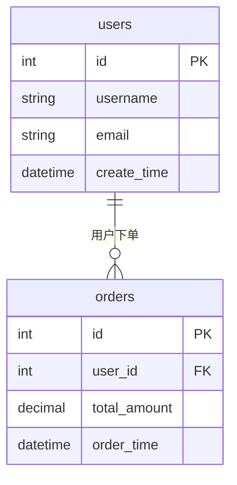

# PM3.0 数据库设计生成器

版本: 1.0.0
作者: Claude

## 入口点

- 类型: conversation
- 系统提示词: `/Users/eason/Documents/Obsidian Vault/.agents/skills/pm3-02-prd2dbdesign/prompts/system_prompt.md`

## 参数

| 参数名 | 描述 | 必需 | 默认值 |
|--------|------|------|--------|
| requirement_idx_doc | 功能索引文档路径（Markdown格式） | 是 | - |
| dialect | 数据库方言（mysql/oracle） | 否 | mysql |
| generate_ddl | 是否生成DDL文件 | 否 | true |
| generate_er | 是否生成ER图 | 否 | true |
| recommend_indexes | 是否生成索引推荐 | 否 | true |
| compare_with | 历史版本文件路径（用于版本对比） | 否 | - |
| openspec_source | OpenSpec系分文档路径（用于复用领域模型） | 否 | - |

## 工作规则

1. **语言要求**
   - 必须使用中文与用户交流
   - 所有生成的文件必须为中文

2. **设计规范**
   - 遵守 PM3.0 数据库设计规范
   - 自动添加审计字段（id, create_by, update_by, create_time, update_time, is_del, remark）
   - 检测并标记禁止新建的系统统一表

3. **禁止新建的系统表前缀**
   - `idm_*` - 身份管理相关表
   - `permission_*` - 权限相关表
   - `mam_*` - 资产管理相关表
   - `mdm_*` - 主数据管理相关表

## 路径说明
- {{vault_path}} = '/Users/eason/Documents/Obsidian Vault'

## 依赖文件

| 类型 | 路径 | 描述 |
|------|------|------|
| file | `{{vault_path}}/20_项目/PM3/rules/db_design_rules.md` | 数据库设计规则 |
| file | `{{vault_path}}/20_项目/PM3/templates/02_db_design_template.md` | 数据库设计模板 |

## 输出

| 类型 | 描述 | 路径 |
|------|------|------|
| markdown | 数据库设计文档 | `{{vault_path}}/20_项目/PM3/03-DBDesign/{{module_name}}_数据库设计文档.md` |
| sql | DDL SQL文件 | `{{vault_path}}/20_项目/PM3/03-DBDesign/{{module_name}}_ddl.sql` |

## 工作流程

1. 读取用户提供的功能索引文档（Markdown格式）
2. 识别文档中的数据实体和字段
3. 依据 db_design_rules 进行表结构设计
4. 自动添加标准审计字段
5. 检测禁止新建的系统统一表并标记
6. 按照 db_design_template 格式输出数据库设计文档
7. 生成可执行的 DDL SQL 文件

## DDL 导出

支持从数据库设计文档自动生成可执行的 SQL DDL 语句。

### 支持的数据库方言

| 方言 | 说明 |
|------|------|
| mysql | MySQL 8.0+，支持 utf8mb4 字符集 |
| oracle | Oracle 12c+ |

### DDL 生成内容

- `CREATE TABLE` 语句（含字段定义、主键、默认值）
- 表注释和列注释
- 索引定义（普通索引、唯一索引）
- 外键约束（可选）
- `DROP TABLE IF EXISTS` 前置语句

### 使用方法

```bash
# 生成 MySQL DDL（默认）
pm3-db-design-generator requirement.md

# 生成 Oracle DDL
pm3-db-design-generator requirement.md --dialect oracle

# 仅生成设计文档，不生成 DDL
pm3-db-design-generator requirement.md --generate_ddl false
```

### 工具脚本

- `tools/ddl_generator.py` - DDL 生成器，可直接调用：
  ```bash
  python tools/ddl_generator.py <设计文档路径> [mysql|oracle]
  ```

## ER 图生成

基于数据库设计自动生成 Mermaid ER 图，可视化表之间的关系。

### 功能特性

- **自动识别关系**: 基于外键字段名（如 `user_id` → `users` 表）自动推断关系
- **支持多种关系**: 一对一、一对多、多对一、多对多
- **ER 图统计**: 生成表数量和关系数量的统计信息

### 关系推断规则

| 模式 | 说明 |
|------|------|
| 显式外键 | 解析 `FOREIGN KEY ... REFERENCES` 语句 |
| 字段名匹配 | `xxx_id` 字段自动关联到 `xxx` 表 |
| 复数处理 | 支持 `user`→`users`, `order`→`orders` 等复数形式 |

### 使用方法

```bash
# 生成 ER 图（默认启用）
pm3-db-design-generator requirement.md

# 禁用 ER 图生成
pm3-db-design-generator requirement.md --generate_er false
```

### 生成示例

生成的 Mermaid ER 图可以直接在支持 Mermaid 的 Markdown 查看器中渲染：



### 工具脚本

- `tools/er_generator.py` - ER 图生成器，可直接调用：
  ```bash
  python tools/er_generator.py <设计文档路径>
  ```

## 智能索引推荐

基于字段名、备注和业务规则自动推荐数据库索引。

### 推荐策略

| 策略 | 说明 | 优先级 |
|------|------|--------|
| 字段名模式 | 自动识别 `*_code`, `*_name`, `status`, `type` 等高频查询字段 | 高 |
| 备注关键词 | 解析 "编码、手机号、状态、查询" 等业务关键词 | 高 |
| 外键关联 | 自动为外键字段添加索引 | 中 |
| 复合索引 | 推荐 `(tenant_id, user_id)`, `(org_id, status)` 等组合 | 中 |

### 索引类型

- 🔑 **主键** (PRIMARY) - 自动识别 id 字段
- ✨ **唯一索引** (UNIQUE) - 编码、手机号、邮箱等
- 📇 **普通索引** (INDEX) - 常用查询字段
- 🔗 **复合索引** (COMPOSITE) - 多字段联合查询

### 使用方法

```bash
# 生成索引推荐（默认启用）
pm3-db-design-generator requirement.md

# 禁用索引推荐
pm3-db-design-generator requirement.md --recommend_indexes false
```

### 工具脚本

- `tools/index_recommender.py` - 索引推荐器，可直接调用：
  ```bash
  python tools/index_recommender.py <设计文档路径>
  ```

## 版本对比

支持数据库设计文档的版本对比和变更检测，生成迁移脚本。

### 对比功能

- **新增表检测** - 标识新增的表结构
- **删除表检测** - 标识已删除的表
- **字段变更** - 检测新增、删除、修改的字段
- **DDL 迁移脚本** - 自动生成 ALTER TABLE 语句

### 变更类型

| 图标 | 类型 | 说明 |
|------|------|------|
| 🟢 | 新增 | 新增表或字段 |
| 🟡 | 修改 | 修改字段属性 |
| 🔴 | 删除 | 删除表或字段 |

### 使用方法

```bash
# 对比两个版本
pm3-db-design-generator requirement_v2.md --compare_with requirement_v1.md

# 生成包含以下内容的对比报告：
# - 变更统计（新增/修改/删除）
# - 详细字段变更列表
# - DDL 迁移脚本
```

### 工具脚本

- `tools/version_manager.py` - 版本管理器，可直接调用：
  ```bash
  python tools/version_manager.py <旧版本> <新版本>
  ```

### 输出示例

```markdown
## 版本对比报告

### 📊 变更统计
- 🟢 新增表: 2 个
- 🟡 修改表: 3 个
- 🔴 删除表: 1 个

### 📝 详细变更

#### 🟡 orders
**修改字段**:
- `~` `total_amount`: 类型: `INT` → `DECIMAL(10,2)`

## DDL 迁移脚本

```sql
ALTER TABLE `orders` MODIFY COLUMN `total_amount` DECIMAL(10,2) NULL;
```
```

## OpenSpec 集成

与系分设计阶段打通，复用 OpenSpec 中的领域模型生成数据库设计。

### 功能特性

- **解析领域模型**: 从系分文档提取聚合根、实体、领域事件
- **自动映射**: 领域对象自动映射为数据库表
- **关联处理**: 自动识别一对多、多对一关系，生成外键
- **审计字段**: 自动为所有表添加标准审计字段

### 映射规则

| 领域概念 | 数据库映射 | 说明 |
|----------|------------|------|
| 聚合根 | 主表 | 生成独立主表 |
| 实体 | 从表 | 聚合内的实体生成从表，含父表外键 |
| 值对象 | 嵌入字段 | 值对象属性嵌入主表 |
| 领域事件 | 事件表 | 可选生成事件存储表 |
| 关联关系 | 外键 | 自动添加外键字段和索引 |

### 类型映射

| 领域类型 | Java类型 | 数据库类型 |
|----------|----------|------------|
| String | String | VARCHAR(255) |
| Integer | Integer | INT |
| Long | Long | BIGINT |
| Boolean | Boolean | TINYINT(1) |
| BigDecimal | BigDecimal | DECIMAL(18,2) |
| LocalDateTime | LocalDateTime | DATETIME |
| Date | Date | DATE |
| Text | String | TEXT |
| JSON | String | JSON |

### 使用方法

```bash
# 从 OpenSpec 系分文档生成数据库设计
pm3-db-design-generator requirement.md --openspec_source system_analysis.md

# 生成流程：
# 1. 读取系分文档，解析领域模型
# 2. 映射为数据库表结构
# 3. 自动添加审计字段
# 4. 生成外键关联和索引
# 5. 输出完整的数据库设计文档
```

### 系分文档格式示例

```markdown
### 聚合根: Order

属性:
| 名称 | 类型 | 说明 |
|------|------|------|
| orderNo | String | 订单编号 |
| totalAmount | BigDecimal | 订单总金额 |
| status | String | 订单状态 |
| orderItems | List<OrderItem> | 订单明细 |

### 实体: OrderItem

属性:
| 名称 | 类型 | 说明 |
|------|------|------|
| productId | Long | 商品ID |
| quantity | Integer | 数量 |
| price | BigDecimal | 单价 |
```

### 生成结果

```markdown
### 表名: orders
**来源领域对象**: Order

| 字段名 | 类型 | 长度 | 必填 | 默认值 | 说明 |
|--------|------|------|------|--------|------|
| id | BIGINT | - | 否 | - | 主键ID [PK] |
| order_no | VARCHAR | 255 | 是 | - | 订单编号 |
| total_amount | DECIMAL | 18,2 | 是 | - | 订单总金额 |
| status | VARCHAR | 255 | 是 | - | 订单状态 |
| create_by | BIGINT | - | 是 | - | 创建人ID |
| create_time | DATETIME | - | 是 | - | 创建时间 |
| ... | ... | ... | ... | ... | ... |

### 表名: orders_order_items
**来源领域对象**: OrderItem（Order的从表）

| 字段名 | 类型 | 长度 | 必填 | 默认值 | 说明 |
|--------|------|------|------|--------|------|
| id | BIGINT | - | 否 | - | 主键ID [PK] |
| order_id | BIGINT | - | 否 | - | 关联Order的ID [FK] |
| product_id | BIGINT | - | 是 | - | 商品ID |
| quantity | INT | - | 是 | - | 数量 |
| price | DECIMAL | 18,2 | 是 | - | 单价 |
| ... | ... | ... | ... | ... | ... |
```

### 工具脚本

- `tools/openspec_adapter.py` - OpenSpec 适配器，可直接调用：
  ```bash
  python tools/openspec_adapter.py <系分文档路径> [markdown|json]
  ```
