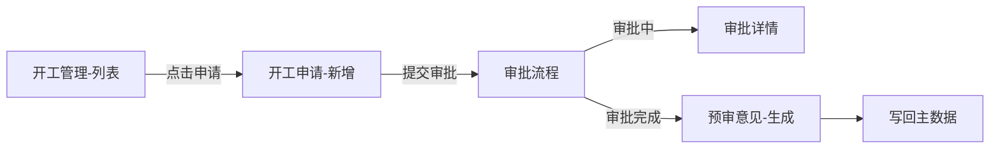

# {项目名} {模块名} 功能索引

> **文档说明**
> - 原始PRD：`{PRD文件名}`
> - 覆盖章节：功能性需求 → {模块名}
> - 生成时间：{日期}
> - 用途：本文档是模块功能全景地图，用于快速定位和导航
> - 注意：详细字段、规则、状态机见 `details/` 目录下的详情文件

---

## 目录

- [全景图](#全景图)
- [功能清单](#功能清单)
- [跨功能关联](#跨功能关联)
- [审批流特殊节点汇总](#审批流特殊节点汇总)
- [待确认项](#待确认项)

---

## 全景图



> 说明：箭头表示数据流转或触发关系，方括号内为功能点名称

---

## 功能清单

### E1：{Epic/模块名称}

| 功能点 | 一句话描述 | 核心实体 | 关键状态 | 详情文件 |
|--------|-----------|----------|---------|----------|
| 开工管理-列表 | 查询项目开工申请，支持按业态/状态筛选 | ProjectStartApp | 草稿/审批中/审批完成/审批驳回 | [[details/开工管理-列表\|查看]] |
| 开工申请-新增 | 首次/二次/重新开工申请录入 | ProjectStartApp | 同列表 | [[details/开工申请-新增\|查看]] |
| 预审意见-生成 | 系统根据表单+参数自动生成预审参考意见 | PreReviewOpinion | 无（单次计算） | [[details/预审意见-生成\|查看]] |
| 审批详情-查看 | 查看申请详情，展示审批历史 | ProjectStartApp | 同列表 | [[details/审批详情-查看\|查看]] |

> **图例**：
> - 核心实体：该功能操作的主要数据实体
> - 关键状态：涉及的状态机状态（详情文件有完整状态图）
> - 详情文件：点击跳转查看完整字段、规则、状态机

---

## 跨功能关联

### 共享实体

| 实体名 | 被哪些功能共用 | 说明 |
|--------|---------------|------|
| ProjectStartApp | 列表、新增、详情、编辑 | 开工申请主实体 |
| PreReviewOpinion | 预审生成、审批详情展示 | 预审意见，审批时参考 |

### 状态依赖

```
审批完成 ──→ 可触发「二次开工」
    │
    └──→ 触发预审意见生成 ──→ 写回主数据
```

### 规则复用

| 规则名 | 复用场景 | 所在详情文件 |
|--------|---------|-------------|
| 工期计算规则 | 预审意见生成、审批节点参考 | [[details/预审意见-生成\|预审意见-生成]] |
| 毛利率达标判定 | 预审意见生成、审批节点覆盖 | [[details/预审意见-生成\|预审意见-生成]] |

### 外部依赖

| 外部系统 | 依赖功能点 | 数据流向 |
|----------|-----------|---------|
| 项目主数据 | 新增、编辑 | 读取项目基础信息 |
| 红线图评审 | 新增（自动带出） | 读取关联流程 |
| 目标成本评审 | 新增（自动带出） | 读取关联流程 |

---

## 审批流特殊节点汇总

> 以下节点在通用审批流转之外，有特殊业务动作需要业务服务实现。其余节点（同意/驳回/抄送）为标准审批能力，由审批微服务处理。

| # | 节点名称 | 审批角色 | 特殊动作描述 | 影响/后置逻辑 | 详情 |
|---|---------|---------|------------|-------------|------|
| 1 | 会签-成本部填写 | 分公司成本人员 | 可修改关联目标成本流程 | 更新申请单成本数据 | [[details/审批-成本部\|查看]] |
| 2 | 会签-技术部填写 | 分公司设计人员 | 填写项目设计容量 | 更新 designCapacity | [[details/审批-技术部\|查看]] |
| 3 | 审批-财务BP填写 | 业财BP | 填写毛利率相关字段 | 触发系统达标判定 | [[details/审批-财务BP\|查看]] |
| 4 | 审批-上传会议纪要 | 计划经理 | 确认毛利率结论，上传纪要 | **控制后续流程分支** | [[details/审批-会议纪要\|查看]] |
| 5 | 审批通过后置 | 系统自动 | 状态回调触发 | 写回项目主数据 | [[details/审批-后置动作\|查看]] |

---

## 待确认项

> 以下内容在PRD中以图片形式呈现，或描述不完整，需与产品确认后补充到对应详情文件

| # | 所在功能点 | 待确认内容 | 影响范围 | 状态 |
|---|-----------|----------|---------|------|
| 1 | 预审意见-生成 | 预审意见完整字段清单（PRD图片未能解析） | 影响数据模型设计 | ⏳ 待补充 |
| 2 | 审批详情-PMO节点 | PMO节点各板块字段完整清单（部分被遮挡） | 影响审批详情页开发 | ⏳ 待补充 |
| 3 | 新增-选择项目 | 选择项目弹窗的完整字段和搜索逻辑 | 影响项目选择组件 | ⏳ 待补充 |

---

*本索引由 prd-analyzer Skill (CMD-INDEX) 自动生成，如需更新请重新执行 CMD-INDEX 命令。*
