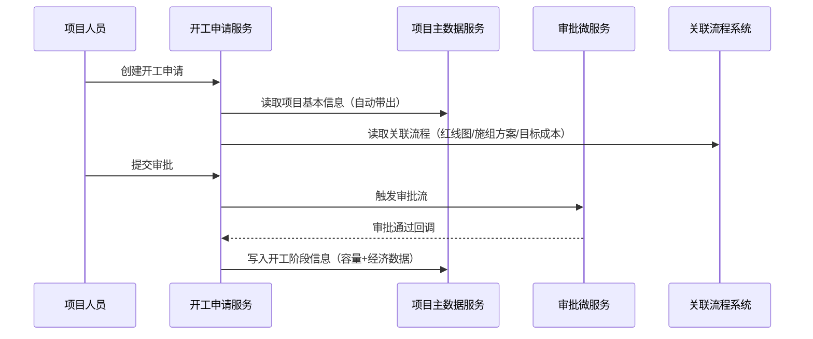
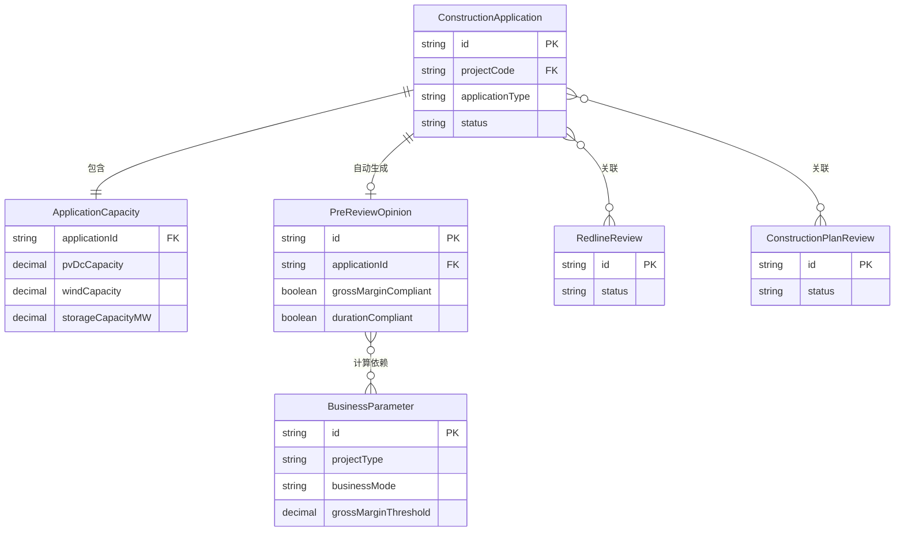

# {项目名} 技术需求分析报告

> 文档说明：本报告由技术经理基于PRD生成，面向开发人员。角色权限、审批流配置由平台微服务统一处理，报告中仅声明依赖，不展开实现细节。

---

## Section 1：项目上下文

**系统定位**：{一句话描述系统定位和本次迭代目标}

**本次迭代范围**：
- E1 {模块名}
- E2 {模块名}

**术语词典**（开发重点关注）：

| 术语 | 技术含义 |
|------|---------|
| 开工申请 | 首次发起的开工流程实体，区别于二次开工（同实体不同状态/类型） |
| 二次开工 | applicationType = SECOND 的开工申请，复用首次申请的基本信息 |
| 重新开工 | applicationType = RESTART，作废原流程重新发起，累计容量字段逻辑不同 |
| 预审意见 | 系统根据申请信息+业务参数自动计算生成的结构化结论，非人工填写 |

**外部系统依赖总览**：

| 系统名称 | 交互方向 | 说明 |
|---------|---------|------|
| 项目主数据服务 | 读取 + 写入 | 创建申请时读取项目信息；审批通过后回写开工阶段数据 |
| 红线图审批系统 | 读取 | 关联已通过的开工版红线图流程 |
| 施工组织方案系统 | 读取 | 关联最新版施工组织方案（不限审批状态） |
| 目标成本系统 | 读取 | 关联最新审批通过的目标成本评审 |
| 权限微服务 | 调用 | 所有列表接口按角色+组织范围过滤数据 |
| 审批微服务 | 调用 | 审批流流转，submit接口触发；特殊节点动作由业务服务实现 |

---

## Section 2：业务链路梳理

### 2.1 整体业务时序



### 2.2 审批流节点声明

> 审批节点配置、流转、通知由**审批微服务**处理。下表仅标注需要业务服务配合实现的特殊动作。

| 节点序号 | 节点名称 | 审批角色 | 特殊业务动作 | 对应 Task |
|---------|---------|---------|------------|---------|
| 1 | 分公司PMO审核 | 分公司PMO专员 | 无 | - |
| 2 | 分公司成本人员审核 | 分公司成本人员 | 可修改关联目标成本流程，系统自动刷新单瓦成本 | T?.?.? |
| 3 | 分公司设计人员审核 | 分公司设计人员 | 填写项目设计容量 | T?.?.? |
| 4 | 业财BP审核 | 业财BP | 填写毛利率/毛利额（本次+全容量）并上传测算文件；系统自动判定毛利率达标状态 | T?.?.? |
| 5 | 总部计划组经理审核 | 项目管理部计划经理 | 确认毛利率达标结论（可修改）、填写评审结论、上传会议纪要；结论影响后续审批流分支（达标→EPC副总裁；未达标→全部副总裁+总裁） | T?.?.? |

---

## Section 3：领域模型

### 3.1 实体总览

| 实体名 | 中文名 | 类型 | 说明 |
|--------|-------|------|------|
| ConstructionApplication | 开工申请 | 聚合根 | 核心业务实体，含三种申请类型 |
| ApplicationCapacity | 申请容量 | 值对象 | 隶属于开工申请，按业态有不同字段组合 |
| PreReviewOpinion | 预审意见 | 实体 | 系统自动生成，关联开工申请 |
| BusinessParameter | 业务参数配置 | 配置实体 | IT维护，含毛利率阈值和参考工期配置 |
| RedlineReview | 红线图评审 | 外部实体引用 | 仅存储ID和状态快照，数据源在红线图系统 |
| ConstructionPlanReview | 施工组织方案评审 | 外部实体引用 | 同上 |
| TargetCostReview | 目标成本评审 | 外部实体引用 | 同上 |

### 3.2 实体详细定义

#### ConstructionApplication（开工申请）

**类型**：聚合根

**字段清单**：

| 字段名(英文) | 中文名 | 类型 | 约束 | 来源/说明 |
|-------------|-------|------|------|---------|
| id | 主键 | String | PK | 系统生成 |
| applicationNo | 申请编号 | String | 唯一 | 系统生成 |
| applicationType | 申请类型 | Enum | 必填 | FIRST/SECOND/RESTART |
| projectCode | 项目编号 | String | 必填,FK | 从主数据选取，限发起人所在分公司+区域 |
| projectName | 项目名称 | String | 只读 | 从项目主数据带出，不可修改 |
| projectType | 项目业态 | Enum | 只读 | 光伏/风电/储能，从主数据带出 |
| projectSubType | 业态细分 | Enum | 必填 | 光伏:[平地/渔光/山地]，风电:[平地/山地]，储能:[平地/山地] |
| businessMode | 业务模式 | Enum | 必填 | BT/EPC/自持 |
| province | 省 | String | 只读 | 从主数据带出 |
| city | 城市 | String | 只读 | 从主数据带出 |
| county | 县 | String | 只读 | 从主数据带出 |
| detailAddress | 详细地址 | String | 可修改 | 从主数据带出，允许修改 |
| companyBranch | 所属分公司 | String | 只读 | 从主数据带出 |
| region | 所属区域 | String | 只读 | 从主数据带出 |
| hasSafetyInsurance | 是否购买安工一切险 | Boolean | 必填 | 手动选择 |
| needOperationService | 是否需要运维服务 | Boolean | 必填 | 手动选择 |
| indicatorCapacity | 项目指标容量(MW) | Decimal | 选填 | 从指标认定流程自动获取，无则为空 |
| designCapacity | 项目设计容量(MW) | Decimal | 选填 | 审批节点由设计人员填写 |
| accumulatedApprovedCapacity | 累计通过开工容量 | Decimal | 二次开工必填 | SECOND类型时显示且必填，RESTART不显示 |
| applicationSummary | 申请概述 | Text | 选填 | 文本描述 |
| status | 状态 | Enum | 系统维护 | 见状态机 |
| createdBy | 创建人 | String | 系统写入 | 用户ID |
| createdAt | 创建时间 | DateTime | 系统写入 | |
| submittedAt | 提交时间 | DateTime | 系统写入 | |

**状态机**：
```
[DRAFT草稿] --submit()--> [PENDING审批中]
[PENDING] --approve()通过--> [APPROVED已通过]
[PENDING] --reject()驳回--> [REJECTED已驳回]
[REJECTED] --reEdit()--> [DRAFT草稿]
```

---

#### ApplicationCapacity（申请容量）

**类型**：值对象（隶属于 ConstructionApplication）

| 字段名(英文) | 中文名 | 类型 | 约束 | 说明 |
|-------------|-------|------|------|------|
| pvDcCapacity | 光伏直流容量(MWp) | Decimal | 光伏必填 | projectType=光伏时显示 |
| windCapacity | 风电容量(MW) | Decimal | 风电必填 | projectType=风电时显示 |
| storageCapacityMW | 储能规模(MW) | Decimal | 选填 | 光伏/风电配储时填写 |
| storageCapacityMWh | 储能规模(MWh) | Decimal | 储能必填/其他选填 | projectType=储能时必填 |

---

#### BusinessParameter（业务参数配置）

**类型**：配置实体（由IT维护，上线前初始化）

**毛利率阈值配置**：

| 字段名(英文) | 中文名 | 类型 | 说明 |
|-------------|-------|------|------|
| projectType | 项目业态 | Enum | 光伏/风电/储能 |
| businessMode | 业务模式 | Enum | BT/EPC/自持 |
| grossMarginThreshold | 毛利率阈值(%) | Decimal | 判断毛利率是否达标的基准值 |

**参考工期配置**：

| 字段名(英文) | 中文名 | 类型 | 说明 |
|-------------|-------|------|------|
| projectType | 项目业态 | Enum | |
| projectSubType | 业态细分 | Enum | |
| startToFullDays | 开工-全容参考工期(天) | Integer | |
| fullToCommerciaDays | 全容-工商变更参考工期(天) | Integer | |
| fullToProductionDays | 全容-生产移交参考工期(天) | Integer | |
| scalingThresholdMW | 项目规模阈值(MW) | Decimal | 默认200MW，超过此值需线性计算动态工期 |

**业务计算规则（工期计算）**：
```
当 项目设计容量 ≤ scalingThresholdMW(200MW)：
  参考工期 = 静态参考工期（表中配置值）

当 200MW < 项目设计容量 ≤ 500MW：
  动态变量 = round((设计容量 - 200) / (500 - 200) × 60)，最大60天
  参考工期 = 静态参考工期 + 动态变量
  注：动态计算仅适用于【开工-全容】阶段，其他两个阶段不参与计算

当 计划时间跨春节：
  参考工期 += 20天
  判定条件：批准开工时间 到 全容量并网计划完成时间 的区间内含春节
```

---

#### PreReviewOpinion（预审意见）

**类型**：实体（系统自动生成，不可人工录入）

| 字段名(英文) | 中文名 | 类型 | 说明 |
|-------------|-------|------|------|
| applicationId | 关联申请ID | String | FK |
| grossMarginCompliant | 毛利率是否达标 | Boolean | 业财BP填写后自动判定；总部计划经理可修改确认值 |
| durationCompliant | 工期是否符合参考工期 | Boolean | 系统根据计划时间+业务参数计算 |
| ⚠️ 待确认 | 预审意见完整字段清单 | - | PRD中预审意见字段以图片形式呈现，需补充文字说明 |

---

### 3.3 领域模型关系图



---

## Section 4：Story / Task 拆解

### Task 汇总表（可导入Jira/飞书）

| Task编号 | Task标题 | 类型 | 所属Story | 预估工作量 | 前置依赖 |
|---------|---------|------|---------|----------|---------|
| T1.1.1 | 开工申请 DB Schema 设计 | 数据模型 | S1.1 | M | 无 |
| T1.1.2 | 从项目主数据读取基本信息接口集成 | 数据集成-读取 | S1.1 | M | T1.1.1 |
| T1.1.3 | 表单字段联动逻辑（业态→容量字段/细分选项） | 前端-表单 | S1.1 | M | T1.1.1 |
| T1.1.4 | 关联流程自动带出逻辑 | 业务逻辑-后端 | S1.1 | L | T1.1.2 |
| T1.1.5 | 申请容量显示控制逻辑（二次开工/重新开工差异） | 前端-表单 | S1.1 | S | 无 |
| T1.2.1 | 预审意见自动计算服务 | 业务逻辑-后端 | S1.2 | L | T1.1.1 |
| T1.2.2 | 工期动态计算逻辑（含线性计算+春节加天数） | 业务逻辑-后端 | S1.2 | M | T1.2.1 |
| T1.3.1 | 审批节点-业财BP填写毛利率并触发达标判定 | 审批节点-特殊动作 | S1.3 | M | T1.2.1 |
| T1.3.2 | 审批节点-总部计划经理确认达标结论+审批流分支控制 | 审批节点-特殊动作 | S1.3 | M | T1.3.1 |
| T1.3.3 | 审批通过后写回项目主数据（开工阶段容量+经济信息） | 数据集成-写入 | S1.3 | M | T1.3.2 |
| T1.4.1 | 开工申请列表（分页+筛选+数据权限） | 前端-列表 | S1.4 | M | T1.1.1 |
| T1.5.1 | 业务参数配置初始化（毛利率阈值+参考工期） | 配置初始化 | S1.5 | S | T1.1.1 |

> 工作量说明：S=0.5天，M=1-2天，L=3天

### Task 详情

#### T1.1.2 从项目主数据读取基本信息接口集成

- **类型**：数据集成-读取
- **说明**：用户选择项目编号后，系统调用项目主数据服务读取并自动填充基本信息字段。可选项目范围限定为发起人所在分公司+区域的、开发权已审批通过的项目。
- **关键规则**：
  - 带出字段（只读）：项目名称、项目业态、业态细分、省市县、所属分公司、所属区域
  - 指标容量从「指标认定流程」获取，无则为空，非必填
  - 详细地址带出后允许用户修改
- **涉及实体**：ConstructionApplication
- **前置依赖**：T1.1.1（DB Schema）

---

#### T1.1.3 表单字段联动逻辑

- **类型**：前端-表单
- **说明**：申请表单中多处字段存在联动显示/必填控制逻辑，需前端实现。
- **关键规则**：
  - 业态 = 光伏：显示「光伏直流容量MWp」（必填）+「储能规模MW/MWh」（选填）；业态细分可选 [平地/渔光/山地]
  - 业态 = 风电：显示「风电容量MW」（必填）+「储能规模MW/MWh」（选填）；业态细分可选 [平地/山地]
  - 业态 = 储能：显示「储能规模MW/MWh」（必填）；业态细分可选 [平地/山地]
  - 申请类型 = FIRST：不显示「累计通过开工容量」
  - 申请类型 = SECOND：显示「累计通过开工容量」（必填）
  - 申请类型 = RESTART：不显示「累计通过开工容量」（视为重新申请）
- **涉及实体**：ConstructionApplication, ApplicationCapacity
- **前置依赖**：无

---

#### T1.2.1 预审意见自动计算服务

- **类型**：业务逻辑-后端
- **说明**：用户提交审批后，系统根据申请表单信息+业务参数配置，自动计算并生成预审意见，展示在审批详情页供审批人参考。
- **关键规则**：
  - 触发时机：申请提交审批（submit）后立即计算
  - 毛利率达标判定：`全容量毛利率 >= grossMarginThreshold` → 达标，否则不达标（阈值按 projectType + businessMode 组合查询）
  - 工期计算规则：见 BusinessParameter 业务计算规则章节（含线性计算和春节规则）
  - ⚠️ 待确认：预审意见完整字段清单（PRD以图片呈现，需产品补充文字版）
- **涉及实体**：PreReviewOpinion, BusinessParameter
- **前置依赖**：T1.1.1

---

#### T1.3.2 审批节点-总部计划经理确认达标结论+审批流分支控制

- **类型**：审批节点-特殊动作
- **说明**：总部计划组经理在「上传开工评审会议纪要」节点，需填写评审结论、上传会议纪要，并确认毛利率达标判定（可覆盖系统自动判定结果）。该节点的最终确认结果控制后续审批流分支走向。
- **关键规则**：
  - 该节点允许修改「毛利率是否符合公司要求」（覆盖系统自动判定）
  - 最终结论 = 达标 → 后续节点：EPC副总裁审批（单人）
  - 最终结论 = 不达标 → 后续节点：所有副总裁 + 总裁审批
  - 分支逻辑需通过审批微服务的条件分支配置实现，本 Task 负责在该节点回调时向审批微服务传递分支参数
- **涉及实体**：PreReviewOpinion（更新 grossMarginCompliant 确认值）
- **前置依赖**：T1.3.1，审批微服务条件分支配置

---

#### T1.3.3 审批通过后写回项目主数据

- **类型**：数据集成-写入
- **说明**：开工申请审批最终通过后，系统调用项目主数据服务，更新项目的开工阶段信息。
- **关键规则**：
  - 触发时机：审批微服务回调「全流程通过」事件
  - 写入内容：以申请表单基本信息更新主数据基本信息；写入「开工」阶段容量信息
    - FIRST：写入本次申请开工容量
    - SECOND：写入累计通过开工容量
    - RESTART：写入本次申请开工容量（覆盖原记录）
  - 同时写入经济信息（毛利率、毛利额，来自业财BP节点填写）
  - 需保证幂等性（防止重复回调重复写入）
- **涉及实体**：ConstructionApplication
- **前置依赖**：T1.3.2，项目主数据写入接口联调

---

## Section 5：API 设计骨架

#### 开工申请 /api/construction-applications

| Method | Path | 描述 | 权限说明 |
|--------|------|------|---------|
| GET | / | 列表查询（分页+多条件筛选） | 调用权限服务，按角色+组织范围过滤 |
| POST | / | 创建申请（生成草稿） | 项目人员 |
| GET | /{id} | 查询详情 | 项目人员/各审批角色 |
| PUT | /{id} | 编辑申请 | 仅 DRAFT/REJECTED 状态可编辑 |
| POST | /{id}/submit | 提交审批 | 调用审批微服务，同时触发预审意见计算 |
| POST | /{id}/restart | 发起重新开工 | 项目人员，仅已完结的申请可操作 |

**关键字段（POST / body）**：

| 字段名 | 类型 | 必填 | 说明 |
|--------|------|------|------|
| projectCode | String | 是 | 限发起人所在分公司+区域范围 |
| applicationType | Enum | 是 | FIRST/SECOND/RESTART |
| detailAddress | String | 否 | 可修改，其余基本信息只读带出 |
| applicationCapacity | Object | 是 | 按业态包含不同子字段 |
| accumulatedApprovedCapacity | Decimal | 条件必填 | SECOND类型必填 |
| relatedFlows | Object | 否 | 关联流程ID列表（红线图/施组/成本） |
| attachments | Array | 否 | 附件ID列表 |

**外部服务调用**：
- 读取 项目主数据服务：选择项目时，获取基本信息字段
- 读取 指标认定流程系统：获取项目指标容量
- 读取 红线图/施组/目标成本系统：关联流程自动带出
- 写入 项目主数据服务：审批全流程通过后，更新开工阶段信息

---

#### 业务参数配置 /api/business-parameters

| Method | Path | 描述 | 权限说明 |
|--------|------|------|---------|
| GET | /gross-margin | 查询毛利率阈值配置 | IT管理员/只读角色 |
| PUT | /gross-margin | 更新毛利率阈值 | IT管理员 |
| GET | /duration | 查询参考工期配置 | IT管理员/只读角色 |
| PUT | /duration | 更新参考工期配置 | IT管理员 |

---

## Section 6：非功能性需求摘要

| 类型 | 要求 | 开发注意点 |
|------|------|----------|
| 性能 | 列表查询响应 <2s | 评估多条件筛选+数据权限过滤下的索引设计 |
| 安全 | 数据按组织范围隔离 | 依赖权限微服务，接口层注入过滤条件，无需自行实现 |
| 异常处理-外部读取 | 主数据/关联流程系统不可用 | 降级策略待确认：⚠️ 是报错还是允许手动填写？ |
| 异常处理-审批回调 | 回调失败或重复 | 写回主数据需保证幂等性，建议异步队列+重试 |
| 数据迁移 | 历史OA流程数据完整迁移 | 含历史审批痕迹和业务参数，需单独排期评估 |

---

*⚠️ 本报告中标注「待确认」的内容，请与产品经理核实后更新。*
